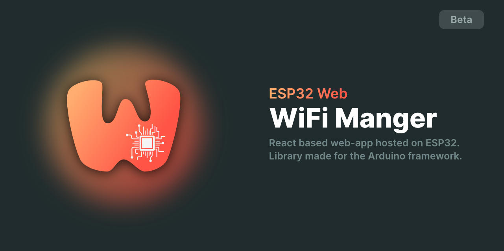

### ESP32 Web
# WiFi Manager Library - v 0.1.1



### Quickest way to get started with this library is via this short video tutorial:
#### [Getting Started Tutorial](https://youtu.be/lcbPMxtgacM)

---
As per the video above, in "platformio.ini" file add the following lines:

```bash

monitor_speed = 115200
extra_scripts = ./littlefsbuilder.py

```

https://esp32web.com/